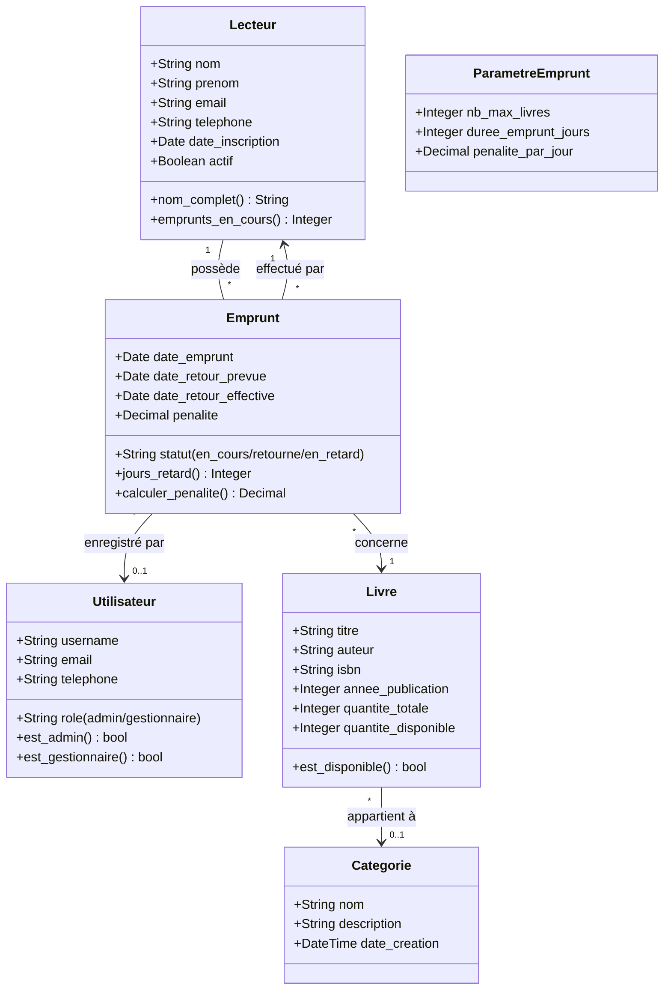
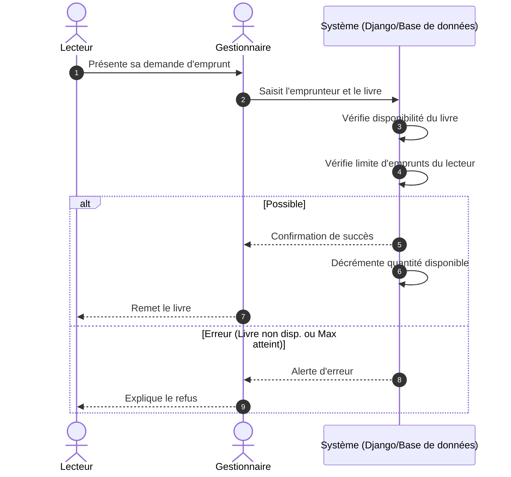
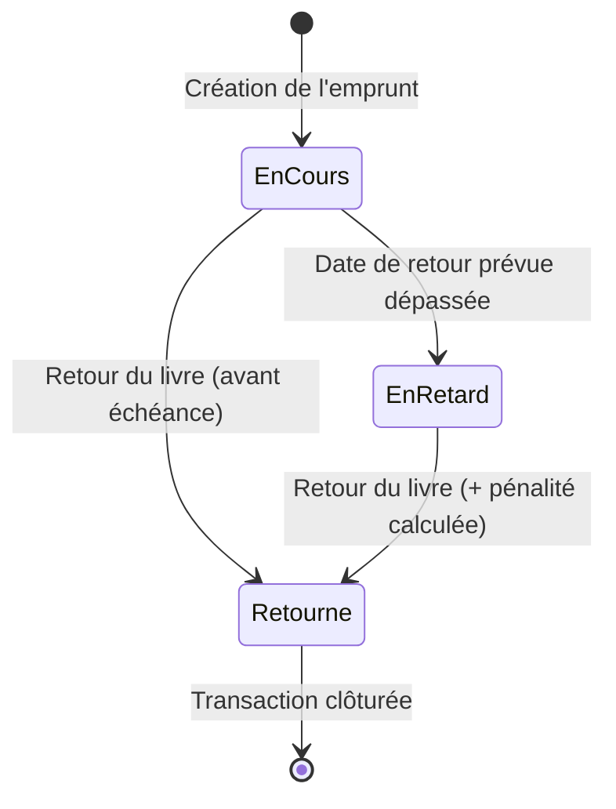

# Conception UML — Gestion de Bibliothèque ISP/Isiro

Ce document présente la modélisation UML du système de gestion de bibliothèque numérique.

## 1. Diagramme de Cas d'Utilisation (Use Case Diagram)

Le système distingue deux types d'acteurs : l'**Administrateur** et le **Gestionnaire**.

```mermaid
useCaseDiagram
    actor "Administrateur" as Admin
    actor "Gestionnaire" as Gest

    package "Système de Gestion de Bibliothèque" {
        usecase "S'authentifier" as UC1
        usecase "Gérer les Livres (CRUD)" as UC2
        usecase "Gérer les Catégories" as UC3
        usecase "Gérer les Lecteurs" as UC4
        usecase "Enregistrer un Emprunt" as UC5
        usecase "Enregistrer un Retour" as UC6
        usecase "Générer Rapport d'Emprunts" as UC7
        usecase "Consulter les Statistiques" as UC8
        usecase "Gérer les Utilisateurs" as UC9
        usecase "Configurer les Paramètres" as UC10
    }

    Admin --> UC1
    Admin --> UC2
    Admin --> UC3
    Admin --> UC9
    Admin --> UC10
    
    Gest --> UC1
    Gest --> UC4
    Gest --> UC5
    Gest --> UC6
    Gest --> UC7
    Gest --> UC8
    
    %% Héritage des droits
    Admin --|> Gest
```

---

## 2. Diagramme de Classes (Class Diagram)

Ce diagramme représente la structure des données et les relations entre les différentes entités du projet Django.



---

## 3. Description des Relations

- **Livre & Catégorie** : Un livre peut appartenir à une seule catégorie, tandis qu'une catégorie peut regrouper plusieurs livres.
- **Emprunt & Lecteur** : Un lecteur peut effectuer plusieurs emprunts au fil du temps.
- **Emprunt & Livre** : Chaque enregistrement d'emprunt lie un lecteur spécifique à un livre spécifique.
- **Utilisateur & Emprunt** : Le système garde une trace du gestionnaire ayant validé chaque transaction (traçabilité).

---

## 4. Diagramme de Séquence (Sequence Diagram)

Ce diagramme illustre le processus métier typique d'un **nouvel emprunt**.



---

## 5. Diagramme d'États (State Diagram)

Ce diagramme montre le cycle de vie d'un **Emprunt** dans le système.



> [!TIP]
> Ce document sert de base pour toute évolution future du schéma de base de données ou pour la formation de nouveaux développeurs sur le projet.
